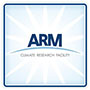
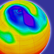
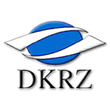
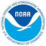
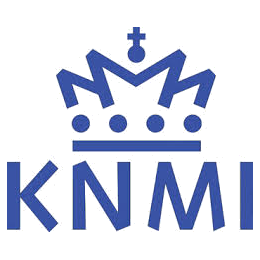
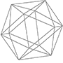

<h3>Collaborators</h3>

  
  <a class="collaborator-title" href="http://www.anu.edu.au">Australian National University (ANU)</a>

  
  <a class="collaborator-title" href="http://www.arm.gov">Atmospheric Radiation Measurement (ARM)</a>

  
  <a class="collaborator-title" href="http://badc.nerc.ac.uk/home/">British Atmospheric Data Centre (BADC)</a>

  
  <a class="collaborator-title" href="https://www.dkrz.de"> Deutsches Klimarechenzentrum (DKRZ)</a>

  
  <a class="collaborator-title" href="http://www.esrl.noaa.gov">Earth System Research Laboratory (ESRL)</a>

  
  <a class="collaborator-title" href="http://www.es.net">Energy Sciences Network (ESnet)</a>

  
  <a class="collaborator-title" href="http://www.gfdl.noaa.gov">Geophysical Fluid Dynamics Laboratory (GFDL)</a>

  
  <a class="collaborator-title" href="http://go-essp.gfdl.noaa.gov">Global Organization for Earth System Science Portal (GO-ESSP)</a>

  
  <a class="collaborator-title" href="http://globus.org">Globus Alliance </a>

  
  <a class="collaborator-title" href="http://vis.cs.ucdavis.edu/Ultravis/">Institute for Ultrascale Visualization</a>

  
  <a class="collaborator-title" href="http://www.jpl.nasa.gov">Jet Propulsion Laboratory (JPL)</a>

  
  <a class="collaborator-title" href="http://www.knmi.nl">Koninklijk Nederlands Meteorologisch Instuut (KNMI)</a>

  
  <a class="collaborator-title" href="http://www.mpim-bonn.mpg.de">Max Planck Institute for Mathematics (MPIM)</a>

  
  <a class="collaborator-title" href="http://www.ncdc.noaa.gov">National Climatic Data Center (NCDC)</a>

  
  <a class="collaborator-title" href="https://www.opensciencegrid.org/bin/view">Open Science Grid</a>

  
  <a class="collaborator-title" href="https://sdm.lbl.gov/sdmcenter/">Scientific Data Management Center for Enabling Technologies</a>

  
  <a class="collaborator-title" href="http://www.txcorp.com">Tech-X Corporation</a>

  
  <a class="collaborator-title" href="https://www.xsede.org/tg-archives">TeraGrid </a>

  
  <a class="collaborator-title" href="http://www.vistrails.org/index.php/Main_Page">VisTrails</a>

  
  <a class="collaborator-title" href="http://www.vacet.org">Visualization and Analytics Center for Enabling Technologies (VACET)</a>

