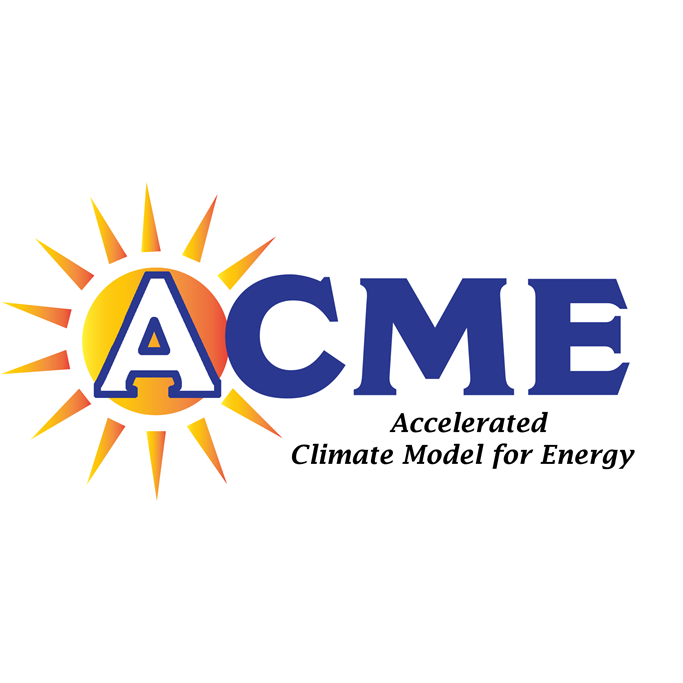

<h2>Projects</h2>

  <a href="mission.html">
    <h4 class="muted">AIMS</h4>
    
  </a>

  <a href="uvcdat.html">
    <h4 class="muted">UV-CDAT</h4>
    
  </a>

 

  <a href="esgf.html">
    <h4 class="muted">ESGF</h4>
    
  </a>

  <a href="acme.html">
    <h4 class="muted">ACME</h4>
    
  </a>

<h2>Sponsors</h2>

  <a href="http://energy.gov/">
    <h4 class="muted">DOE</h4>
     
  </a>

  <a href="http://www.nasa.gov/">
    <h4 class="muted">NASA</h4>
     
  </a>

