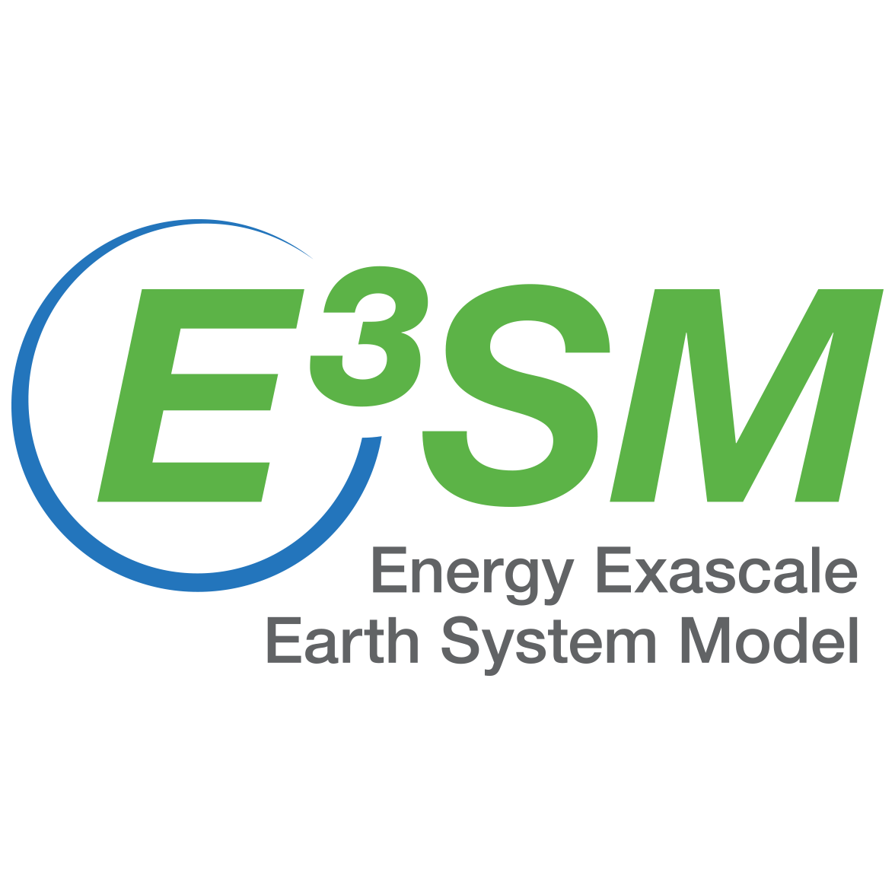
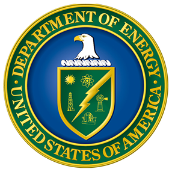
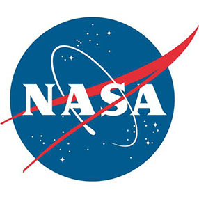

<h2>Projects</h2>

    

        <a href="mission.html">
            <h4 class="muted">AIMS</h4>
            
        </a>
    

    

        <a href="#" target="_blank">
            <h4 class="muted">E3SM</h4>
            
        </a>
    

    

        <a href="https://cdp.llnl.gov" target="_blank">
            <h4 class="muted">CDP</h4>
            
        </a>
    

    

        <a href="https://dream.llnl.gov" target="_blank">
            <h4 class="muted">DREAM</h4>
            
        </a>
    
 

    

        <a href="http://esgf.llnl.gov" target="_blank">
            <h4 class="muted">ESGF</h4>
            
        </a>
    

    

        <a href="https://pcmdi.llnl.gov" target="_blank">
            <h4 class="muted">PCMDI</h4>
            
        </a>
    

    

        <a href="https://uvcdat.llnl.gov" target="_blank">
            <h4 class="muted">CDAT</h4>
            
        </a>
    

 

<h2>Sponsors</h2>

    

        <a href="http://energy.gov/" target="_blank">
            <h4 class="muted">DOE</h4>
             
          </a>
    

    

        <a href="http://www.nasa.gov/" target="_blank">
            <h4 class="muted">NASA</h4>
             
        </a>
    

