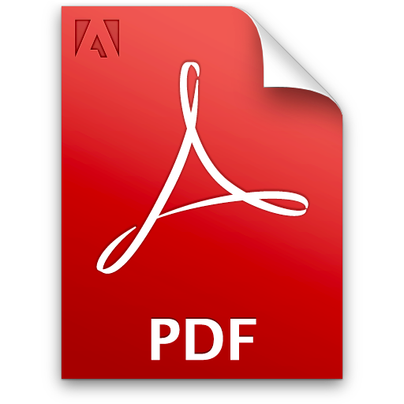

<h2>Publications</h2>

  
  <a class="publication-title" href="http://aims-group.github.io/pdf/nerd_herding_WCECS2015.pdf" target="_blank">Nerd Herding: Practical Project Management in the Field</a>
  
Project managers and developers don't always see eye-to-eye on what tools to use. So what happens when an unstoppable force meets an immovable object? Something has to give. We have had to find a balance of keeping the project management happy, while simultaneously conforming to their documentation and time-management policies. We also have had to keep our development team on task and moving forward in a way that is most efficient for the project. In this paper, we discuss the techniques, tools, and methodologies we're using to stay on track, and the compromises we've had to make in order to keep as many people happy about the process as possible.

  
  <a class="publication-title" href="http://aims-group.github.io/pdf/Science-as-a-Service_WCECS2015.pdf" target="_blank">Science as a Service</a>
  
As the threat of global warming comes out of the land of speculation and into the real world, the demand for accurate, repeatable climate science is growing at a tremendous pace. To help the ever-increasing number of researchers with their ballooning datasets, climate science tools need to improve in tandem. The current paradigm of passing terabytes of raw data over the network repeatedly and the wide variety of semi-compatible tools needs to be replaced. We are doing so with a single web application, able to handle the diverse needs and growing demands of the climate science world, following the same continuous delivery deployment model as SaaS businesses. Lawrence Livermore National Laboratory and the ACME project are uniquely suited to fill this void in the scientist’s tool kit; we are at the crux of data providers’ networks, HPC infrastructure, researchers, and the developers building the tools. This paper will discuss the challenges faced by this effort and the prototype, which is currently in development.

  
  <a class="publication-title" href="http://aims-group.github.io/pdf/Webengine_WCECS2014.pdf" target="_blank">Webengine</a>
  
Webengine is an ancient piece of Kryptonian technology designed to terraform an outdated website such that its style and content are aligned with newer websites. Keeping a website up-to-date, not only with content but also with styling, is what keeps users and customers coming back. They may not always be happy with these changes (look at Facebook), but the ability to quickly refresh your website is imperative to staying relevant. Two new Python scripts webengine.py and webshooter.py strives to do just that. The days of dynamically creating basic websites using php and mysql have passed. Powerful new tools such as Hyde and Jekyll are the keys to quick website creation today. With webshooter, a system administrator or even a project leader can create a new and fresh looking website with one of three different style options and then populate it with the data and content from the previous website by running webengine.

  
  <a class="publication-title" href="media/pdf/strategic_roadmap.pdf" target="_blank">Department of Energy Strategic Roadmap for Earth System Science Data Integration</a>
  
The U.S. Department of Energy (DOE) Office of Biological and Environmental Research (BER) Climate and Environmental Sciences Division (CESD) produces a diversity of data, information, software, and model codes across its research and informatics programs and facilities. This information includes raw and reduced observational and instrumentation data, model codes, model-generated results, and integrated data products. Currently, most of these data and information are prepared and shared for program specific activities, corresponding to CESD organization research. A major challenge facing BER CESD is how best to inventory, integrate, and deliver these vast and diverse resources for the purpose of accelerating Earth system science research. This paper provides a concept for a CESD Integrated Data Ecosystem and an initial roadmap for its implementation to address this integration challenge in the “Big Data” domain.

  
  <a class="publication-title" href="http://onlinelibrary.wiley.com/doi/10.1002/2014EO420002/abstract" target="_blank">Visualization and Analysis Tools for Ultrascale Climate Data</a>
  
Increasingly large climate model simulations are enhancing our understanding of the processes and causes of anthropogenic climate change, thanks to very large public investments in high-performance computing at national and international institutions. Various climate models implement mathematical approximations of nature in different ways, which are often based on differing computational grids. These complex, parallelized coupled system codes combine numerous complex submodels (ocean, atmosphere, land, biosphere, sea ice, land ice, etc.) that represent components of the larger complex climate system.

  
  <a class="publication-title" href="http://esg-pcmdi.llnl.gov/publications_and_documents/HPDC10_BWC_Final.pdf/view" target="_blank">Lessons learned from moving Earth System Grid data sets over a 20 Gbps wide-area network</a>
  
In this paper, we report on obstacles overcome and the key lessons learned in moving a small portion (10 TB) of the multimodel Coupled Model Intercomparison Project, Phase 3 data set used in the IPCC Fourth Assessment Report from three sources—the Argonne Leadership Computing Facility (ALCF), Lawrence Livermore National Laboratory (LLNL), and National Energy Research Scientific Computing Center (NERSC)—to the 2009 Supercomputing conference (SC09) show floor in Portland, Oregon.

  
  <a class="publication-title" href="http://esg-pcmdi.llnl.gov/publications_and_documents/ExpReports-ESG-SC09_final.pdf/view" target="_blank">Experience Report on the Supercomputing 2009 Bandwidth Challenge from the Perspective of the Earth System Grid</a>
  
The Supercomputing 2009 (SC09) Bandwidth Challenge entry titled, “High Performance GridFTP Transport of Earth System Grid (ESG) Data,” demonstrated high-performance GridFTP transport of climate data from multiple Department of Energy laboratories to the targeted SC09 showroom floor. The transferred multi-terabyte data consisted of a small portion of the multi-model Coupled Model Intercomparison Project, Phase 3 (CMIP-3) data set used in the Intergovernmental Panel on Climate Change (IPCC) Fourth Assessment Report (AR4).

  
  <a class="publication-title" href="http://www.scidacreview.org/0902/html/esg.html" target="_blank">The Planet at Their Fingertips: Climate Modeling Data Heats Up</a>
  
Overview of the importance of the Earth System Grid to the Climate Community (Upcoming SciDAC Review Article). ---------------- D. N. Williams, R. Ananthakrishnan, D. E. Bernholdt, S. Bharathi, D. Brown, M. Chen, A. L. Chervenak, L. Cinquini, R. Drach, I. T. Foster, P. Fox, S. Hankin, V. E. Henson, P. Jones, D. E. Middleton, J. Schwidder, R. Schweitzer, R. Schuler, A Shoshani, F. Siebenlist, A. Sim, W. G. Strand, N. Wilhelmi, M. Su, “The Planet at Their Fingertips: Climate Modeling Data Heats Up”, in the SciDAC Review Magazine, Issue 9, Spring 2009.

  
  <a class="publication-title" href="http://ams.allenpress.com/perlserv/?request=get-abstract&doi=10.1175/2008BAMS2459.1" target="_blank">The Earth System Grid: Enabling Access to Multi-Model Climate Simulation Data</a>
  
History and impact of the Earth System Grid on the Climate Community. (BAMS Report published February 2009.) ---------------- D N Williams, R Ananthakrishnan, D E Bernholdt, S Bharathi, D Brown, M Chen, A L Chervenak, L Cinquini, R Drach, I T Foster, P Fox, D Fraser, J Garcia, S Hankin, P Jones, D E Middleton, J Schwidder, R Schweitzer, R Schuler, A Shoshani, F Siebenlist, A Sim, W G Strand, M Su, N. Wilhelmi, “The Earth System Grid: Enabling Access to Multi-Model Climate Simulation Data”, in the Bulletin of the American Meteorological Society, February 2009.

  
  <a class="publication-title" href="http://esg-pcmdi.llnl.gov/publications_and_documents/Extreme_Scale_Data_Mgmt_Panel Report.pdf/view" target="_blank">Extreme Scale Computing Workshop</a>
  
Joint Office of Biological and Environmental Research (BER) and the Office of Advanced Scientific Computing Research (ASCR) on challenges in climate change science and the role of computing at the extreme scale. December, 2008.

  
  <a class="publication-title" href="http://www.iop.org/EJ/abstract/1742-6596/125/1/012072" target="_blank">Data Management and Analysis for the Earth System Grid </a>
  
Overview of climate data management challenges and server-side analysis in ESG (SciDAC 2008 Conference). ------------ D. N. Williams, R. Ananthakrishnan, D. E. Bernholdt, S. Bharathi, D. Brown, M. Chen, A. L. Chervenak, L. Cinquini, R. Drach, I. T. Foster, P. Fox, S. Hankin, V. E. Henson, P. Jones, D. E. Middleton, J. Schwidder, R. Schweitzer, R. Schuler, A Shoshani, F. Siebenlist, A. Sim, W. G. Strand, N. Wilhelmi, M. Su, “Data Management and Analysis for the Earth System Grid”, in the Journal of Physics: Conference Series, SciDAC ’08 conference proceedings, volume 125. ([Citation:] D N Williams et al 2008 J. Phys.: Conf. Ser. 125 012072)

  
  <a class="publication-title" href="http://dx.doi.org/10.1109/CTS.2008.4543934" target="_blank">Web Enabled Collaborative Climate Visualization in the Earth System Grid</a>
  
Kendall, W.; Glatter, M.; Jian Huang; Hoffman, F.; Bernholdt, D.E.; Collaborative Technologies and Systems, 2008. CTS 2008. International Symposium on 19-23 May 2008 Page(s):212 - 220

  
  <a class="publication-title" href="http://www.sc.doe.gov/ober/berac/Climate_Modeling_Final_Joint_ASCAC-BERAC_Report.pdf" target="_blank">Advanced Scientific Computing Advisory Committee and Biological and Environmental Advisory Committee</a>
  
Prepared Joint ASCAC-BERAC Subcommittee report on computational and informational technology rate limiters to the advancement of climate change science. March, 2008

  
  <a class="publication-title" href="http://www.ctwatch.org/quarterly/articles/2007/11/the-earth-system-grid-center-for-enabling-technologies-enabling-community-access-to-petascale-climate-datasets/" target="_blank">Prepared Joint ASCAC-BERAC Subcommittee report on computational and informational technology rate limiters to the advancement of climate change science. March, 2008</a>
  
A short overview of ESG-CET in the CTWatch Quarterly November 2007 special issue on Software Enabling Technologies for Petascale Science. -------------------- Dean N. Williams, David E. Bernholdt, Ian T. Foster, Don E. Middleton, “The Earth System Grid Center for Enabling Technologies: Enabling Community Access to Petascale Climate Datasets”, in the Cyberinfrastructure Technology Watch (CTWatch) Quarterly, November 2007, vol 3 number 4.

  
  <a class="publication-title" href="http://www.es.net/pub/esnet-doc/BER-Net-Req-Workshop-2007-Final-Report.pdf" target="_blank">BER Science Network Requirements</a>
  
Report on the Biological and Environmental Research Network Requirements Workshop. The Earth System Grid network requirements are location in section 2.3 on page 12. July 2007

  
  <a class="publication-title" href="http://www.iop.org/EJ/abstract/1742-6596/78/1/012050" target="_blank">Building a global federation system for climate change research: the Earth System Grid Center for Enabling Technologies (ESG-CET)</a>
  
An overview of the ESG-CET project written for the SciDAC 2007 conference. -------------------- R Ananthakrishnan, D E Bernholdt, S Bharathi, D Brown, M Chen, A L Chervenak, L Cinquini, R Drach, I T Foster, P Fox, D Fraser, K Halliday, S Hankin, P Jones, C Kesselman, D E Middleton, J Schwidder, R Schweitzer, R Schuler, A Shoshani, F Siebenlist, A Sim, W G Strand, N. Wilhelmi, M Su, and D N Williams, “Building a Global Federation System for Climate Change Research: The Earth System Grid Center for Enabling Technologies (ESG-CET)”, in the Journal of Physics: Conference Series, SciDAC ’07 conference proceedings. ([Citation]: R Ananthakrishnan et al 2007 J. Phys.: Conf. Ser. 78 012050)

